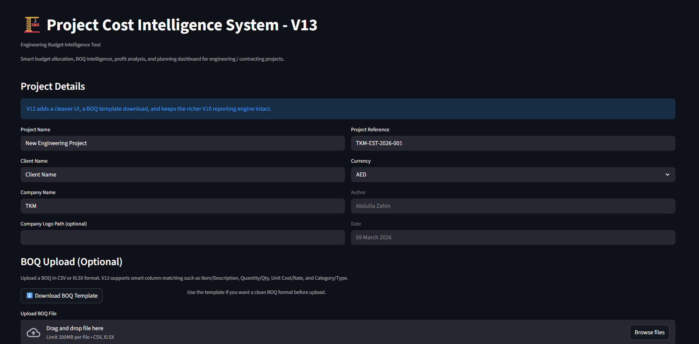

# 🏗️ Project Cost Intelligence System

### Engineering Budget Intelligence Tool

A simple tool designed to make **engineering budgeting and BOQ analysis
easier**.

This project helps engineers, estimators, and project managers quickly
understand project cost distribution, analyze BOQ data, and generate
professional reports.

> Built by an engineer who got tired of fighting spreadsheets at 2 AM.

------------------------------------------------------------------------

## 📊 Dashboard Preview



------------------------------------------------------------------------

## 🚀 Features

### Smart Budget Allocation

Select a project type and automatically load recommended budget
allocations for:

-   Materials
-   Labor
-   Transportation
-   Office Expenses
-   Salaries / Overheads
-   Company Profit
-   Contingency

You can adjust these percentages and instantly see how they affect the
total project budget.

------------------------------------------------------------------------

### BOQ Upload & Analysis

Upload a **Bill of Quantities (BOQ)** file in CSV or Excel format.

The system will automatically:

-   Calculate item costs
-   Group expenses by category
-   Compare **planned vs actual project costs**
-   Highlight cost-heavy areas

------------------------------------------------------------------------

### Visual Cost Insights

The dashboard generates clear visualizations including:

-   Budget distribution charts
-   Category cost breakdown
-   BOQ comparison charts

These visuals help engineers quickly understand project finances.

------------------------------------------------------------------------

### Excel Report Export

Generate structured **Excel reports** containing:

-   Budget breakdown
-   Allocation percentages
-   BOQ analysis
-   Financial insights

------------------------------------------------------------------------

### PDF Report Generation

Create professional **PDF reports** including:

-   Project summary
-   Budget insights
-   Charts and visual analysis
-   Structured report sections

Useful for presentations, internal documentation, and project review
meetings.

------------------------------------------------------------------------

## 💡 Why This Tool Exists

Engineering project budgets are often handled through complex
spreadsheets that are difficult to analyze and visualize.

This tool simplifies the process by combining:

-   Budget planning
-   BOQ analysis
-   Cost visualization
-   Automated reporting

into one easy-to-use dashboard.

------------------------------------------------------------------------

## ⚙️ Installation

Clone the repository:

``` bash
git clone https://github.com/abdulla-zahin/project-cost-intelligence-system.git
```

Move into the project folder:

``` bash
cd project-cost-intelligence-system
```

Install dependencies:

``` bash
pip install -r requirements.txt
```

Run the application:

``` bash
streamlit run project2_v13.py
```

------------------------------------------------------------------------

## 📦 Requirements

    streamlit
    pandas
    matplotlib
    openpyxl

------------------------------------------------------------------------

## 📁 Project Structure

    project-cost-intelligence-system
    │
    ├── project2_v13.py
    ├── requirements.txt
    ├── README.md
    └── images
        └── dashboard.png
    ├── runtime.txt
    ├── .streamlit
        └── config.toml

------------------------------------------------------------------------

## Live Application

You can try the tool here:

(https://project-cost-intelligence-system-oetthbbujrrfmcqjxvxoau.streamlit.app/)

------------------------------------------------------------------------

## 👨‍💻 Author

**Abdulla Zahin**

LinkedIn
https://www.linkedin.com/in/abdulla-zahin-b4643315a/

GitHub
https://github.com/abdulla-zahin

------------------------------------------------------------------------

## 🔮 Future Improvements

This is just the beginning of the **Engineering Budget Intelligence
Tool**.

Possible future improvements include:

-   Professional UI upgrade
-   Multi-project comparison
-   AI-assisted cost intelligence
-   Advanced financial dashboards
-   Contractor performance analysis
